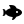

<h1>

Lost Blues
</h1>

 \
 

Restore life to the oceans.

**Limitation**: "3 colors"\
*Your game can only ever show 3 RGB colors on screen at once.*

## User Guide

Start the game by clicking on some **Kelp** to cut it down and collect **Kelp**.

Use this **Kelp** to buy more **Kelp Stems** for **5 Kelp** and create a sustainable source income.

On the left of your toolbar you have a button that can be used to upgrade your cutting power, reducing the amount of clicks required on half on each level.

Finally, get creative! Release Fish, create a relaxing landscape with bubbles, and customise your reef!!

## Credits

**[Fydar](https://github.com/Fydar):** Solo Developer
